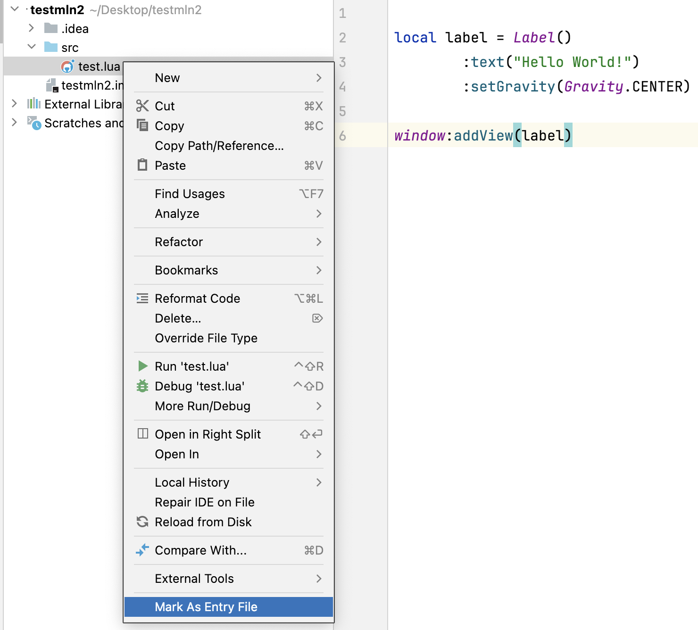
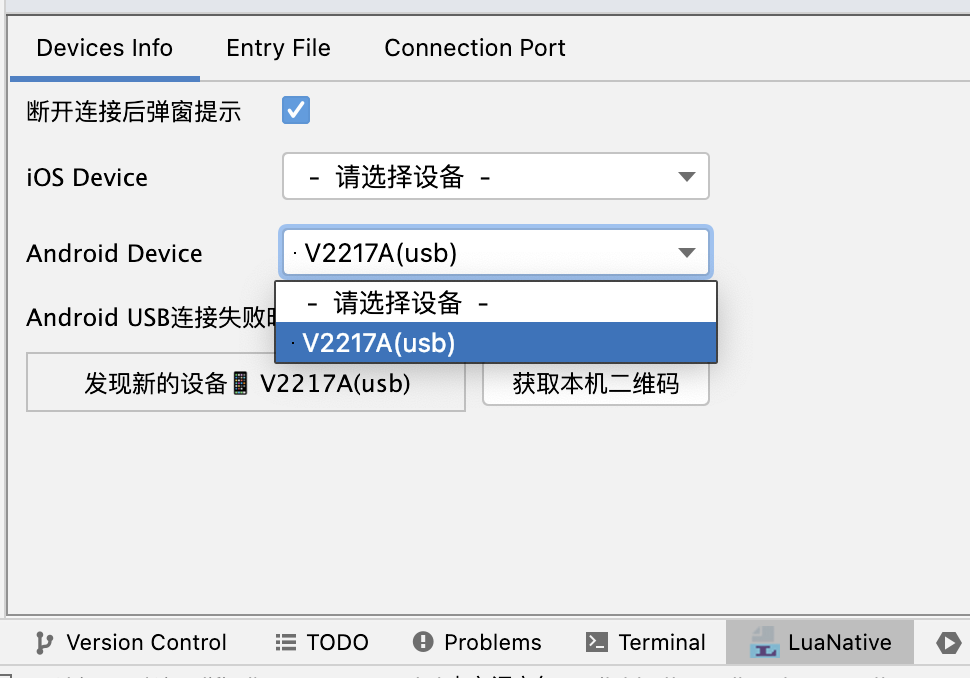
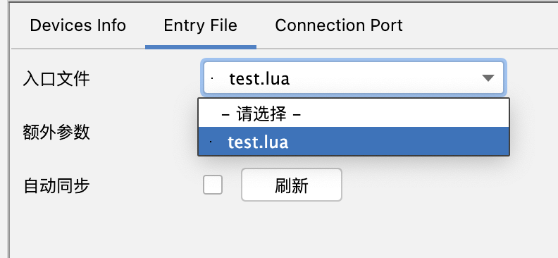

# HotReload 热重载

实时将修改的代码展示在手机上的工具。

# 使用方法

1. 下载最新IntelliJ IDEA CE版本；
2. 在IntelliJ IDEA的插件中，搜索[MLN](https://plugins.jetbrains.com/plugin/18662-mln-hot-reload)，并安装；
3. 创建MLN工程或空工程，并在src目录下（若没有，则新建src目录）新建lua文件，编写相关代码；
4. 右键点击入口文件，点击`Mark As Entry File`，如图：
5. 将手机通过USB连接到电脑（iOS需信任电脑，Android需开启调试并允许调试），在LuaNative面板中，选择连接的手机，如图：
6. 在手机上打开Demo App，进入热重载页面；
7. 在LuaNative面板中，点击Entry File，选择刚才设置的Entry File，如图：
8. 点击刷新，在手机上查看页面效果