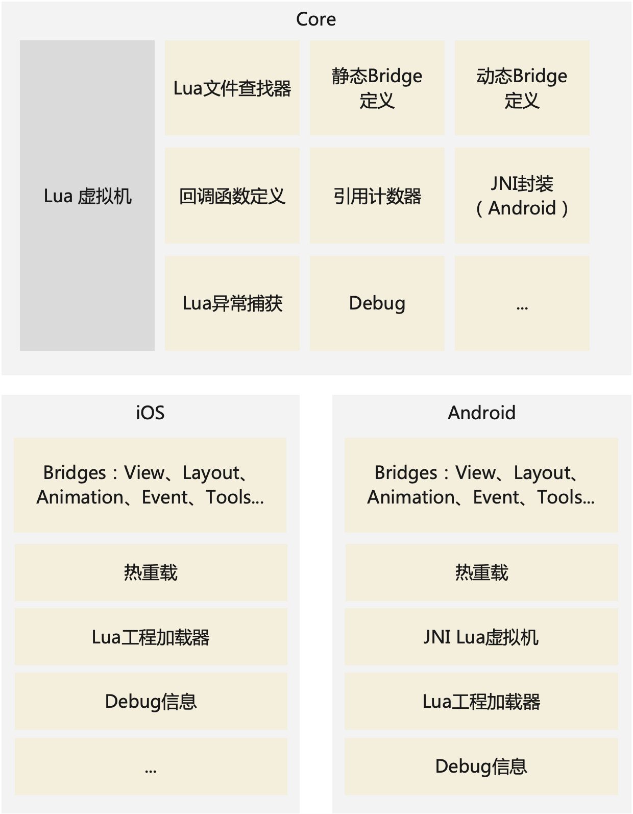
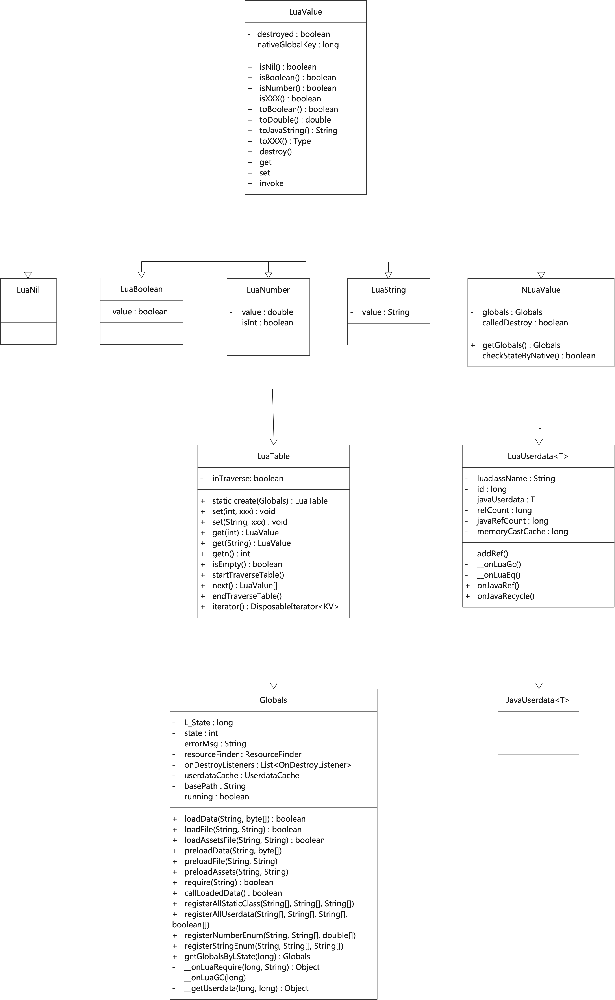

# 技术介绍

## 一、架构


#### 1.1 Lua文件查找器
用来查找Lua项目中Lua文件的路径，类似Java/OC中的import功能：

1. 在各个位置查找对应的Lua文件
> a. 在Lua工程路径中查找
> b. 在assets(Android)中查找
2. 读文件，并编译成Lua虚拟机需要的数据结构
3. 放入Lua虚拟机中执行

#### 1.2 各类Bridge定义
定义静态Bridge、动态Bridge、和Lua回调函数，封装后给原生层调用。

#### 1.3 引用计数器
由于Lua和Java语言都具有GC系统，且两个GC系统并不互通，导致出现不可预期的Bug，因此设计引用计数器来保证两个GC系统互通。

设计原则：

1. 对两方都持有的对象，保证只有在Java释放该对象时，Lua才能释放相应对象；
2. 若对象并非双方持有，则各自通过GC系统释放对象；
3. 所有的view定义为双方均会持有对象；
4. Java层在使用完Lua数据类型对象后，最好手动调用destroy函数；
5. 一般情况，建议一个页面一个虚拟机，保证页面销毁时能将虚拟机销毁，则所有在这期间创建的对象，都能销毁。

#### 1.4 Lua异常捕获
Lua代码中所有的未捕获异常，均会抛到原生层，原生层可选择抛出异常出现崩溃，或捕获异常，并允许程序继续运行，但要注意，Lua异常代码后的代码将无法执行。

#### 1.5 JNI封装
封装为了使Android开发能仅在Java层调用虚拟机函数、开发Bridge等，无需修改native代码。

#### 1.6 Debug
断点调试功能由于稳定性问题暂未开放。

#### 1.7 热重载
热重载模块让开发者在开发过程中能快速在手机上看到实时效果，并在IDE中看到日志输出。


## 二、Bridge介绍

#### 2.1 Lua数据类型
在具体介绍Bridge前，需要先了解Lua的基本数据类型，并了解其特殊含义和用法，若已了解，可跳转到[2.2章节](#22-分类).

Lua数据类型有：
- nil
- boolean
- number
- string
- table
- function
- userdata
- thread

其中我们将重点介绍`table`和`userdata`

##### 2.1.1 table的特殊用法

Lua中除nil外，所有的类型均可设置一个原表（metatable，类型为table），原表中有一些特殊的key，对Lua语言的语法有特殊响应,在这里列举几个常用的：

- __index：查找符号
- __call：函数调用

###### __index特殊用法

```lua
local str = "string"
string.sub(str, 1)
str:sub(1) -- str.sub(str, 1)
```

主要注意第2行和第3行，两行代码返回的结果相同：

1. 在代码`string.sub`中的`string`实际是一个table类型，可以通过`print(type(string))`验证；
2. 在代码`string.sub`中的`sub`实际是`string`这个table中的一个key，其对应的value是一个function类型；
3. `str:sub(1)`和`str.sub(str,1)`等价，这是Lua语言的语法糖，`:`调用表示将自身作为第一个参数放入函数入参中；
4. `str:sub(1)`中的`str`是一个string类型，当在检索`sub`时，实际是获取了string类型的原表(getmetatable)，再从原表中检索`sub`，而原表中只有一个key`__index`，所以会通过`__index`的值，也就是一个table类型来检索`sub`，到此应该能猜到，这个table和1中提到的string是同一个table；
5. `sub`的值由于是一个function类型，所以加上`()`后，就能直接调用；

总结：
```lua
getmetatable("abc") =
{
    __index = --string(table)
    {
        sub = function,
        ...
    }
}
```

###### __call特殊用法

```
local t = {}
setmetatable(t, {
    __call = function() 
        ...
    end
})
t()
```

在上面代码中，最终`t()`会调用`__call`所指代的function。

##### 2.1.2 userdata的特殊用法

Lua对userdata的定义为：用户可将任意的数据类型提供给Lua当做userdata，其操作方式由用户自定义，而定义方式就是通过原表（metatable）来实现，所以userdata的所有操作都离不开表操作。

```
--userdataObj类型为userdata
print(userdataObj.key)
--userdataObj.callMethod(userdataObj)
userdataObj:callMethod()
```

- 代码中`userdataObj.key`的结果和上节描述的表读取数据一样，实际等于`getmetatable(userdataObj).key`；
- 代码中`userdataObj:callMethod()`的结果等于`getmetatable(userdataObj).callMethod(userdataObj)`

#### 2.2 分类

Bridge一般分为2种：

1. 常量Bridge
2. 静态Bridge
3. 动态Bridge

##### 2.1.1 常量Bridge

最简单的Bridge，就是在Lua虚拟机的全局表中增加一个表：

```
ConstantName = {
    key1 = value
}
```

##### 2.1.2 静态Bridge

和常量Bridge类似，在Lua虚拟机的全局表中增加一个表，不过表中的值一般为function类型：

```
BridgeClass = {
    funName = function
}
```

##### 2.1.3 动态Bridge

动态Bridge类似一般面向对象语言的类（class），其Lua调用方式为：
```Lua
local obj = BridgeClass(param1, param2)
obj:callMethod(param1, param2)
```

内部实现原理：

- `BridgeClass`实际为一个全局函数，函数返回值为userdata类型；
- 内部在创建userdata类型时，会根据2.1节所描述的特殊用法，给userdata设置一个原表（metatable），原表中将会把函数名和原生函数一一对应；
- 使用`:`调用时，将把调用放本身放到函数的第一个参数，所以在函数实现时，会拿到真实的原生对象，并调用相应函数。

###### 动态Bridge继承实现

通过2.1节描述可知，当任何类型查找不到对应key时，会查找其原表中的`__index`所指代的表（或函数），因此继承的设计结构大致如此：

```
ParentClass = {
    __index = {
        pfun = function
    }
}
ChildClass = {
    __index = {
        cfun = function
    }
}
setmetatable(ChildClass.__index, ParentClass)
```

当创建`ChildClass`对象时，其对象的原表为`ChildClass`，当调用`pfun`时，由于在`ChildClass`中查找不到对应的值，则会寻找其原表，也就是`ParentClass`，在其中查找到后，返回相应的值。

## 三、jni封装



Lua虚拟机的Java层类设计如图，虚拟机数据类型及操作全部包装，原生开发无需了解Lua虚拟机，即可使用纯Java开发Bridge，以及使用虚拟机中部分功能。